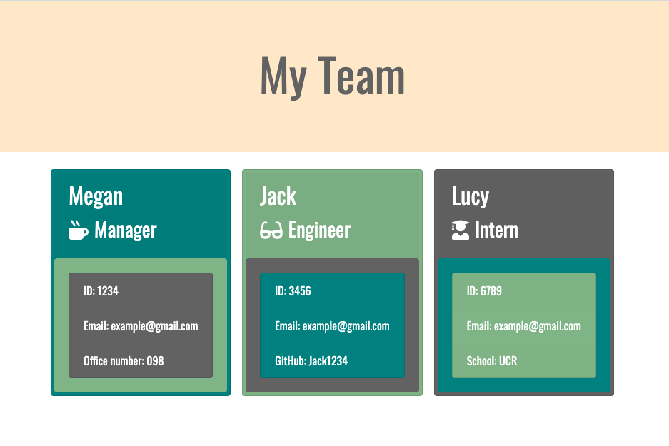

# EmployeeSummaryTemplate
### This application allows managers to create HTML files with information about their employees.

### This project utilizes node.js, and has dependencies on Inquirer and Jest. Numerous tests have been run using Jest to ensure the functionality of the Javascript files. Using Inquirer, the program prompts the user to enter information about their employees. Based on the type of employee they are adding, they will be asked specific additional questions. This information includes:
    * Name
    * ID Number
    * Email Address
    * Additional Info:
        * Managers: Office Number
        * Engineers: Github Username
        * Interns: School Attending
        
### Once all employee information has been collected, it is passed through a JS file which will render the information into an HTML format. This file can then be viewed as a styled webpage, including all relevant information about the employees. Since this application cannot be deployed, I have recorded a video displaying its functionality, attached below.

#### [Demonstration Video](https://drive.google.com/file/d/1tkEJQDxj6QV3QJYoY_TfcAgCGsfuLsgB/view)

#### Below is a screenshot of a sample website created with this program.

